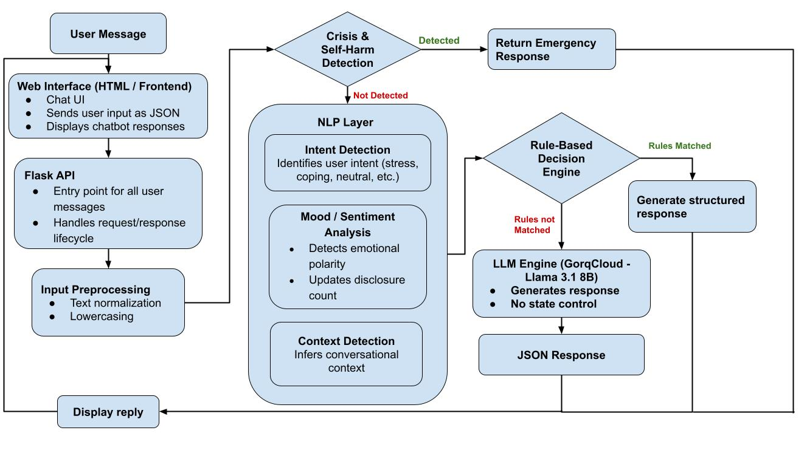

# **Mental Health Chat Bot**

*A calm, safe, and supportive chatbot for emotional well-being*

## **Project Overview**

This project solves the problem of people feeling alone when they are stressed, anxious, or emotionally low. Many people do not always have someone to talk to, and even when they do, it can be hard to open up. This chatbot gives users a simple and safe space to share how they feel.

Mental health chatbots are important because they provide immediate support, encourage people to talk, and can guide them toward calming actions when emotions become heavy. While this bot is not a doctor or therapist, it works as a first-level emotional support system.

This chatbot can be used by students, working professionals, or anyone who wants to talk about their feelings, manage stress, or calm their mind through simple exercises.

## **Features**

* Emotional support through calm and kind conversation

* Detects stress, anxiety, sadness, and distress

* Crisis detection with emergency response

* Remembers conversation state across messages

* Suggests gratitude exercise when distress repeats

* Provides grounding (breathing) exercise when needed

* Uses rule-based logic for safety

* Uses LLM only as a fallback

* Admin emotion monitoring with confidence scores

## **System Architecture**

The system follows a layered hybrid architecture. In Chatbot, messages go through safety checks first, then emotion and intent analysis, then conversation state logic, and finally to either rule-based replies or the LLM.

**Chatbot  architecture**

### **Main Components**

**Frontend (Web UI)**

* Chat interface for users

* Simple text-based conversation

**Backend (API / Server)**

* Flask server

* Handles sessions and conversation state

* Manages safety and response logic

**ML / NLP Model**

* DistilBERT model for emotion detection

* Predicts suicidal, depressive, anxiety, and stress-related language

**LLM Integration (Groq LLaMA3)**

* Used only when rules cannot respond

* Gives natural replies safely

**Database**

* Session storage using Flask session filesystem

## **Technology Stack**

**Frontend**

* HTML, CSS, JavaScript

**Backend**

* Python, Flask, Flask-Session

**ML / NLP**

* DistilBERT

* Hugging Face Transformers

* PyTorch

* TextBlob

**APIs and Frameworks**

* Groq API

* PRAW (Reddit API)

## **Groq LLaMA3 API Setup**

**What is Groq and LLaMA3**  
 Groq is a cloud platform that provides fast access to large language models. LLaMA 3 Instant is a lightweight model used for quick responses.

**Porpose**  
 It is used only when rule-based logic cannot handle a reply. It helps make the chatbot sound natural without controlling safety.

### **Steps**

1. Create a Groq account in [groq.com](http://groq.com)

2. Generate an API key

3. Store the key in `.env` file

Example:

`GROQ_API_KEY=your_api_key_here`

**Limits**

* 30 requests per minute

* 14,400 requests per day

* 6,000 tokens per minute

* 500,000 tokens per day
   
## **Mental Health Chatbot**

The Mental Health Chatbot is the main part of this project. It lets users talk freely about stress, sadness, anxiety, or everyday problems in a safe space. The bot listens to what the user says, checks if anything is risky, understands the feeling behind the message, and then replies in a kind and calm way. When someone feels very low, it can suggest small things like thinking about something good or doing slow breathing. It also remembers past messages so it doesn’t keep asking the same things again. The aim is to make users feel listened to, cared for, and not alone.

## **Chatbot Integration into web application**

The chatbot is connected to the web application into the Bot tab. The frontend sends user messages to the backend using HTTP requests. The backend processes the message, updates the conversation state, and sends back the chatbot’s reply, which is shown in the Bot tab.

## **Installation & Setup**

### **Prerequisites**

* Python 3.8+

* pip

* Groq API key

### **Clone Repository**

`` git clone <repo-url> ``

`` cd project ``

### **Install Dependencies**

`` pip install -r requirements.txt ``

### **Add Environment Variables**

Create `.env` file:

GROQ\_API\_KEY=your\_key\_here

Run Backend

`` python main.py ``

Run Frontend

Open browser and go to:

[http://127.0.0.1:5000](http://127.0.0.1:5000)

## **DistilBERT Emotion Detection Model**

DistilBERT is a smaller and faster version of BERT created by Hugging Face. It keeps most of BERT’s language understanding but runs faster and uses less memory.

This model understands not only direct emotions like “I am sad” but also indirect ones like “I feel empty” or “Nothing excites me.”

**Training Location**

Model was trained in Google Colab, the program is in the `ml_training/` folder.

**Data Extraction**

Data for this project was collected from Reddit using the PRAW library. Four mental health–related subreddits were selected: SuicideWatch, anxiety, stressed, and depressed. From each subreddit, around 300 recent posts were extracted, including the post title, text content, and posting date. This created a dataset that reflects real emotional expressions from online users.

**Data Preprocessing**

After collecting the data, several preprocessing steps were applied. All text was converted to lowercase so that words like “Sad” and “sad” are treated the same. Emojis were removed because they do not add much value for text-based emotion classification. Extra symbols and unnecessary characters were cleaned so the text becomes clear and consistent for training the model.

**Model Training**

The dataset was divided into two parts for model development. About 80% of the data was used for training the model, while the remaining 20% was kept for testing its performance. An iterative stratified splitting method was used so that all emotion labels were fairly distributed in both the training and testing sets. This helps the model learn from balanced data and gives more reliable evaluation results.

Tokenization was done using the DistilBERT tokenizer, which converts text into tokens that the model can understand. All input sentences were padded or cut to a maximum length of 256 tokens so that every sample has the same size. This helps the model process data efficiently and keeps training stable.

The model was trained for 4 epochs on cloud runtime (GPU) in Google Colab, meaning the full dataset was passed through the model four times. A batch size of 8 was used, so the model learned from eight samples at a time. 

**Evaluation**

For evaluation, several metrics were used to understand how well the model performed. These included F1-score (micro, macro, and weighted), Hamming accuracy, and subset accuracy. The model achieved around 79% overall accuracy, showing that it can correctly identify emotional categories in most cases. Confusion matrices were also created for each label to clearly see where the model makes mistakes.

**Prediction Usage**

The trained model predicts four types of emotional signals: suicidal\_ideation, depressive\_language, anxiety\_related, and stress\_related. For every user message (Post), it gives a confidence score for each label. These predictions are not shown to users. They are displayed only on the admin dashboard so the admin can monitor emotional trends and identify risky messages early.

